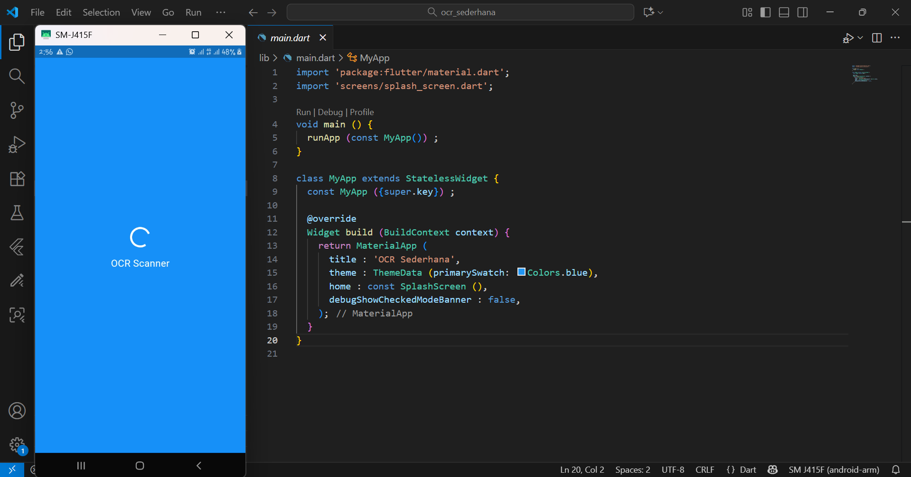
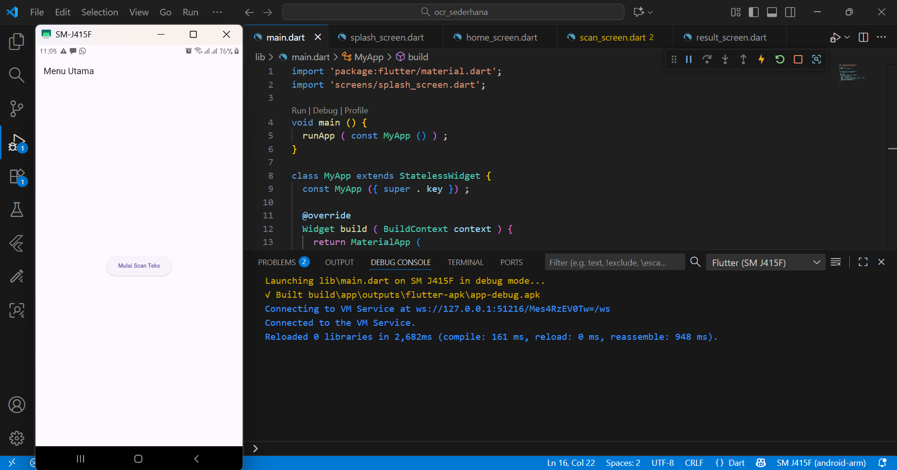
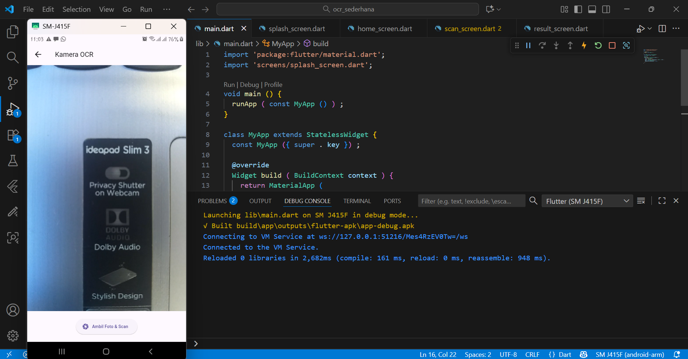
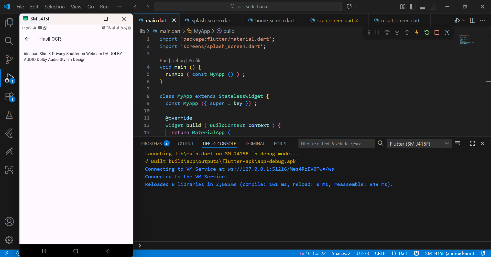
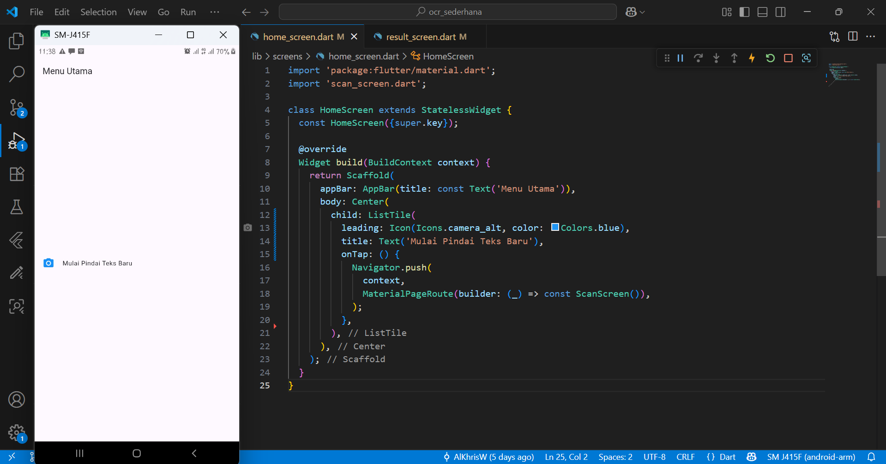
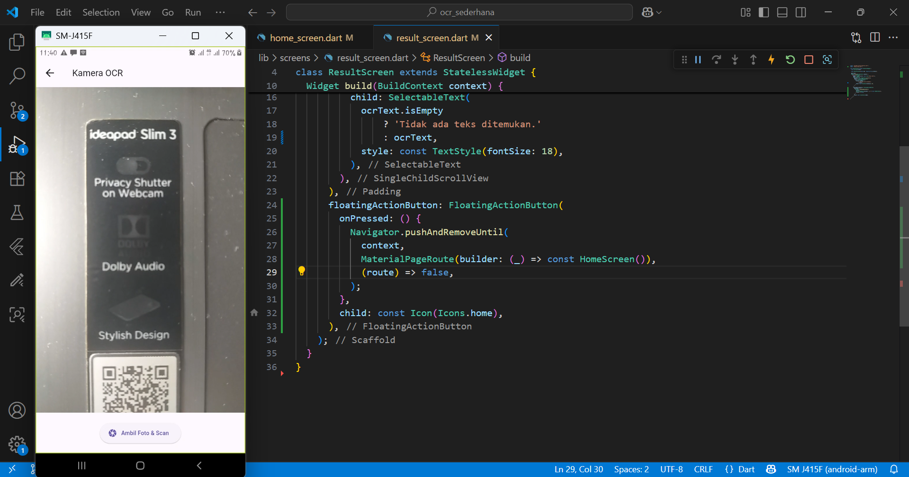
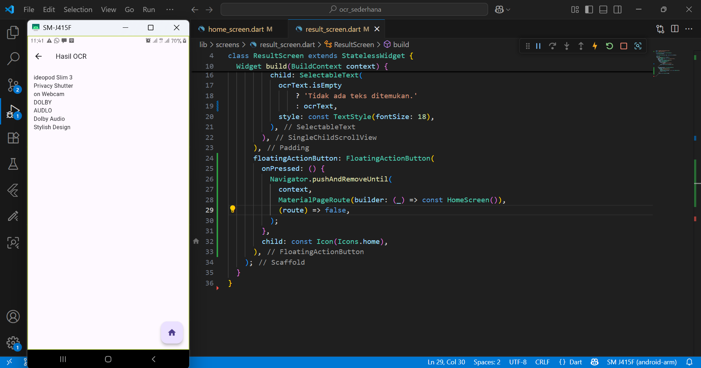
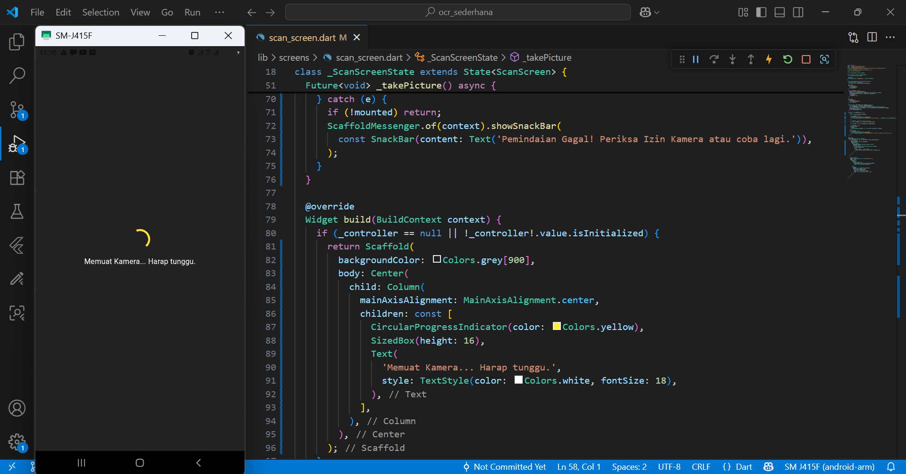

**Nama  : Aldo Khrisna Wijaya**

**NIM   : 2341760091**

**Kelas : SIB - 3C**

# Jobsheet 7 Membangun Aplikasi OCR Sederhana

## Hasil Percobaan

1. Splash Screen

1. Home Screen

1. Scan Screen

1. Result Screen

# UTS Membangun Aplikasi OCR

## Soal 1: Modifikasi Struktur Navigasi dan Aliran

- Tujuan: Menyederhanakan alur navigasi dan meningkatkan pengalaman pengguna di HomeScreen.
1. Pengubahan Navigasi Home:

    • Ubah ElevatedButton di HomeScreen (lib/screens/home_screen.dart) menjadi *widget* **ListTile**.
    
    • Atur ListTile: leading: Icon(Icons.camera_alt, color: Colors.blue);
    title: Text(’Mulai Pindai Teks Baru’).

    • Fungsi onTap harus menggunakan Navigator.push() untuk ke ScanScreen.

    • Hasil:

2. Teks Utuh dan Navigasi Balik:
    
    • Di ResultScreen (lib/screens/result_screen.dart), hapus fungsi ocrText.replaceAllagar hasil teks ditampilkan dengan baris baru (\n) yang utuh.
    
    • Tambahkan FloatingActionButton dengan ikon Icons.home.
    
    • Ketika tombol ditekan, navigasi harus kembali langsung ke HomeScreen menggunakan **Navigator.pushAndRemoveUntil()** (atau metode yang setara) untuk menghapus semua halaman di atasnya dari stack navigasi.

    • Hasil:
    1. scan

    2. hasil

    3. menekan tombol home

## Soal 2: Penyesuaian Tampilan dan Penanganan State/Error

- Tujuan: Memperbaiki tampilan *loading* dan memberikan *feedback* error yang lebih jelas.

1. Custom Loading Screen di ScanScreen:
    • Di ScanScreen (lib/screens/scan_screen.dart), modifikasi tampilan *loading* yang muncul sebelum kamera siap (if (!controller.value.isInitialized)) :
    • Latar Belakang: Scaffold(backgroundColor: Colors.grey[900]).
    • Isi: Di dalam Center, tampilkan Column berisi CircularProgressIndicator(coloColors.yellow).
    • Di bawah indikator, tambahkan Text(’Memuat Kamera... Harap tunggu.’, style: TextStyle(color: Colors.white, fontSize: 18)).

2. Spesifikasi Pesan Error:
    • Di fungsi _takePicture() pada ScanScreen, modifikasi blok catch (e) untuk mengubah pesan *error* pada SnackBar.
    • Pesan SnackBar harus berbunyi: "Pemindaian Gagal! Periksa Izin Kamera atau coba lagi." (Hilangkan variabel *error* ($e)).

3. Hasil:
